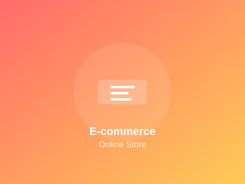
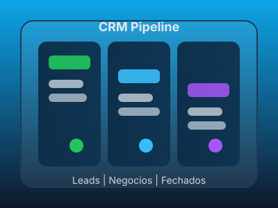
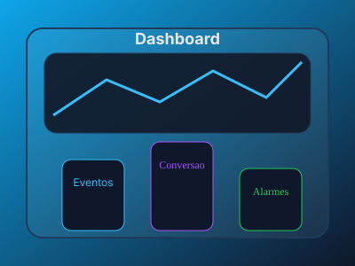
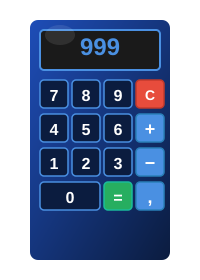
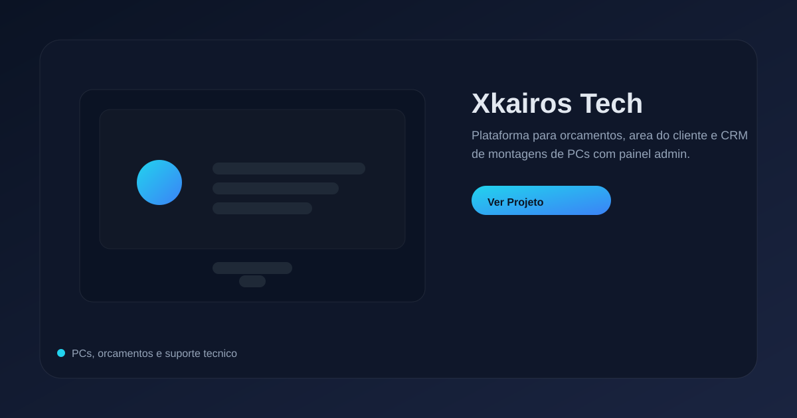

# Portfolio Web - Fullstack MD


Portfólio web moderno e responsivo em HTML, CSS e JavaScript, com páginas estáticas e dados dinâmicos em JSON para projetos, serviços e preços.

## Funcionalidades

- Design responsivo para desktop, tablet e mobile
- Modo escuro/claro com preferência salva
- Animações e scroll suave
- Galeria e página de projetos com dados em JSON
- Páginas institucionais (sobre, serviços, contactos, galeria)
- Componentes reutilizáveis em HTML

## Tecnologias (stack global do repositório)

**Base do portfólio**
- HTML5
- CSS3
- JavaScript (ES6+)
- JSON (dados do site)
- Node.js (server.js para servir localmente)
- PHP (WAMP para projetos em `projects/` que usam PHP)

**Frontend frameworks**
- React (CRA e Vite)
- Vue.js (Vite)
- TypeScript (em projetos específicos)

**Backend / APIs**
- Node.js + Express
- Socket.IO (tempo real)
- JWT (auth)

**Bases de dados**
- PostgreSQL
- MongoDB
- MySQL

**UI/UX e tooling**
- Bootstrap, Tailwind CSS
- Font Awesome
- Swagger (documentação de API)
- Jest (testes)

## Paginas principais

- `index.html`
- `sobre.html`
- `sobre-detalhado.html`
- `servicos.html`
- `galeria.html`
- `projects.html`
- `contactos.html`
- `calculadora-media.html`

## Screenshots

Portfolio:


Projetos:

| Ecommerce | CRM LookCar | App de Tarefas |
| --- | --- | --- |
|  |  |  |
| Dashboard | Calculadora | Xkairos |
|  |  |  |

## Estrutura do projeto

```
Fullstack MD/
|-- assets/                  # Recursos estáticos (imagens, etc.)
|-- components/              # Componentes HTML reutilizaveis
|-- css/                     # Estilos globais e paginas
|-- data/                    # JSONs de projetos, servicos e precos
|-- img/                     # Imagens gerais do site
|-- js/                      # Scripts do site
|-- projects/                # Projetos individuais do portfolio
|-- public/                  # Arquivos publicos (se usados pelo build)
|-- scripts/                 # Scripts auxiliares
|-- src/                     # Codigo fonte (se usado pelo build)
|-- video/                   # Videos do site
|-- curriculo-e-carta/       # CV e carta de apresentação
|-- server.js                # Servidor local (quando usado)
|-- package.json             # Dependencias
|-- index.html
|-- projects.html
|-- README.md
```

## Dados dinamicos

- `data/projects.json`: lista de projetos do portfólio
- `data/services.json`: dados da secção de serviços
- `data/pricing.json`: dados da tabela de preços

## Configuração de ambiente (.env central)

1. Copie `.env.example` para `.env`
2. Preencha os valores de banco
3. Os projetos leem o `.env` da raiz com fallbacks locais

### Variaveis principais

- `POSTGRES_*` e/ou `DATABASE_URL`
- `MONGODB_URI`
- `MYSQL_*`

### Overrides por projeto (opcional)

- `CRM_DATABASE_URL`
- `ECOMMERCE_DATABASE_URL` e `ECOMMERCE_POSTGRES_*`
- `TODO_MONGODB_URI`
- `TASKFLOW_MONGODB_URI`
- `XKAIROS_MYSQL_*`

## Fluxo para novos projetos

1. Crie o projeto em `projects/`
2. Adicione variaveis com prefixo do projeto em `.env.example`
3. No backend, carregue o `.env` da raiz e use fallbacks do prefixo
4. Para bancos SQL, crie a conexao no SQLTools usando as variaveis do `.env`

## Como executar (local)

1. Abrir `index.html` no navegador
2. Ou usar um servidor local:

```bash
# Python
python -m http.server 8000

# Node.js (servidor do portfólio)
$env:PORT=8080; node server.js

# PHP (projetos em PHP)
Use o WAMP (Apache) e aceda via http://localhost/
```

## Como atualizar projetos

1. Edite `data/projects.json`
2. Adicione imagens em `assets/img/projects/` (ou o caminho usado no JSON)
3. Confirme o link do projeto em `projects/` ou para um URL externo

## Deploy (Vercel)

O repositório está ligado ao Vercel. Cada `git push` na branch `main` dispara um deploy automático.

## Contribuição

- Abra uma issue descrevendo a melhoria
- Crie um branch com o nome da feature
- Envie um pull request com descricao objetiva

## Contato

- Email: kauai_lucas@hotmail.com
- GitHub: https://github.com/kauairbq
- LinkedIn: https://linkedin.com/in/kauai-lucas-rocha-bozoli-quinup/
